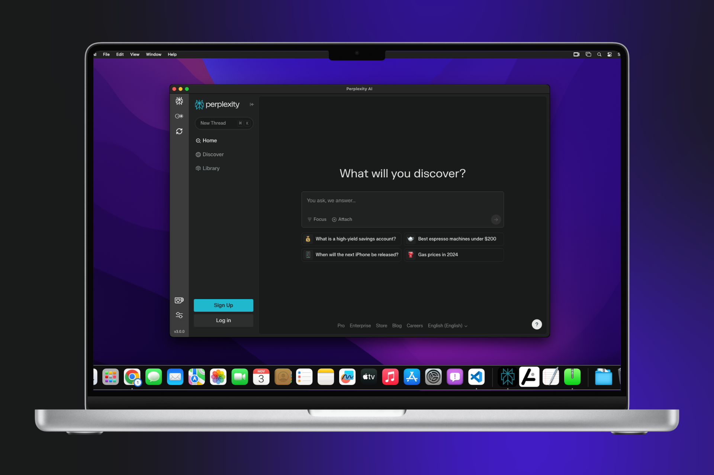

  

<h1 align="center">🚀 Perplexity AI Desktop App 🖥️</h1>

---

  A powerful, streamlined desktop application for Perplexity AI, providing seamless navigation between 🌐 <b>perplexity.ai</b> and 🧪 <b>labs.perplexity.ai</b> with enhanced features and an intuitive interface.

  

  

---

## ✨ Features

- **Unified Interface**: Access all AI tools within a single interface, maintaining data continuity across switches.
- **Sidebar Navigation**: Streamlined, icon-based sidebar for quick and easy access to all AI modes.
- **Settings Section**:
  - Set a **default AI tool** for auto-launch, eliminating the selection step on each startup.
  - **Configurable Shortcuts** for actions like switching AI modes, minimizing, restoring, sending to the tray, and reloading.
- **Update Notifications**: Redesigned update dialog with release notes synced from GitHub.
- **Accidental Close Protection**: Confirmation prompt to prevent accidental app closure when work is in progress.
- **External Link Handling**: Opens external links in the default browser, keeping the focus on the app.
- **Enhanced Usability**: Improved UI and minor tweaks for a cleaner, more intuitive experience.

---

## 📦 Releases

Download the latest releases for Windows, Linux, and macOS from the [releases section](https://github.com/inulute/perplexity-ai-app/releases).

   &nbsp;

---

## 💡 Support and Donations

---

## 🗃️ License

This project is licensed under the GPL-v3 License.

  

---
